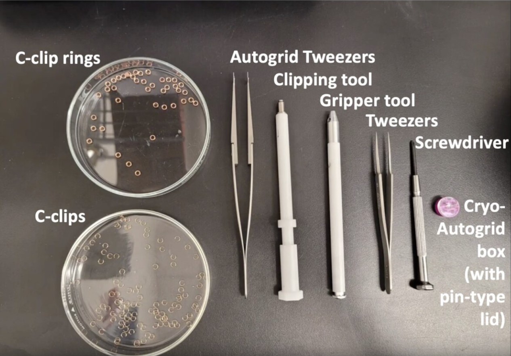
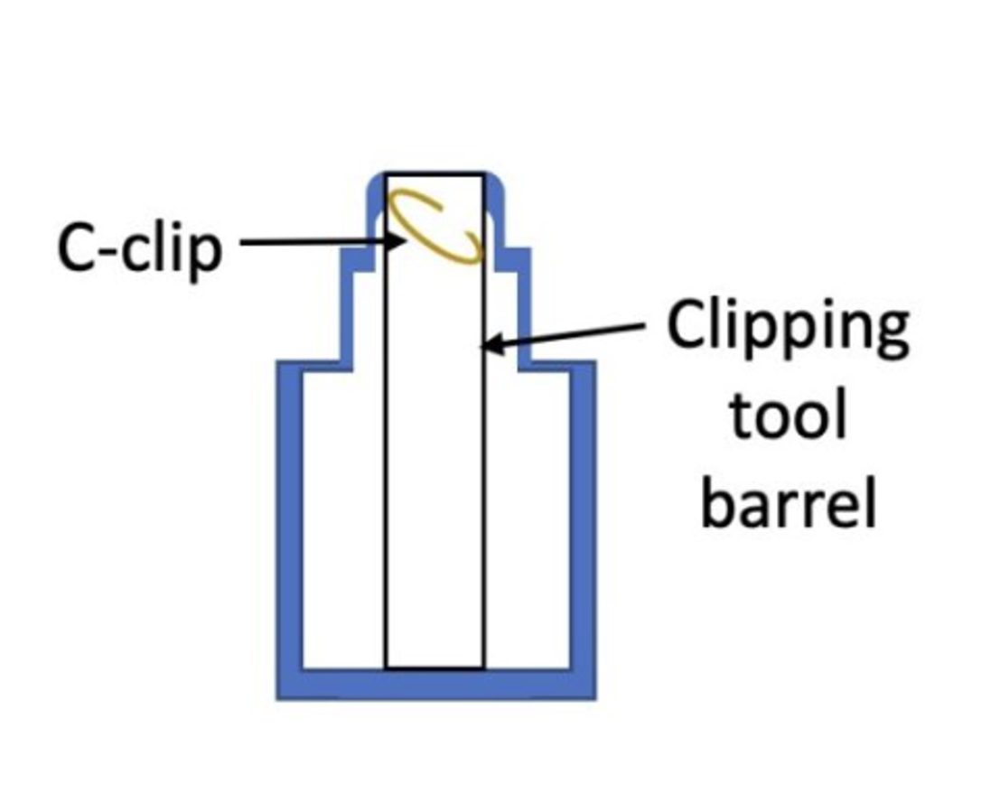
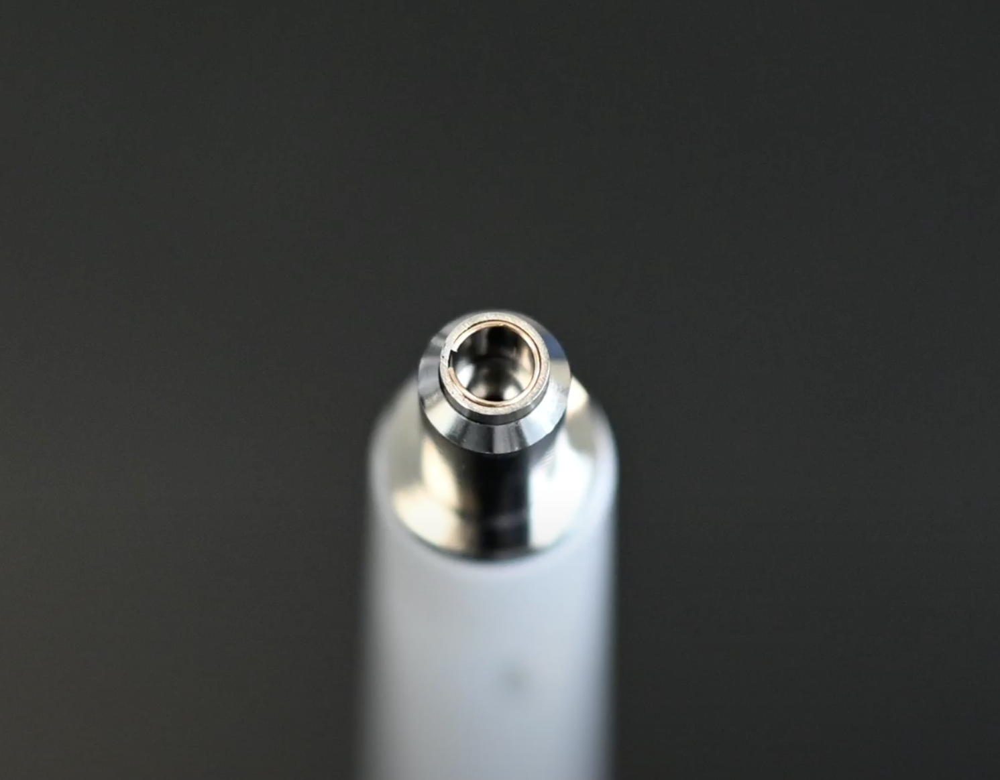
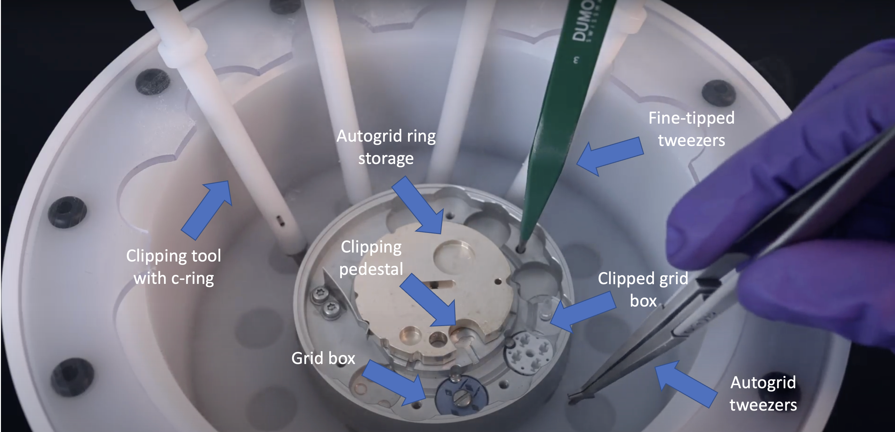
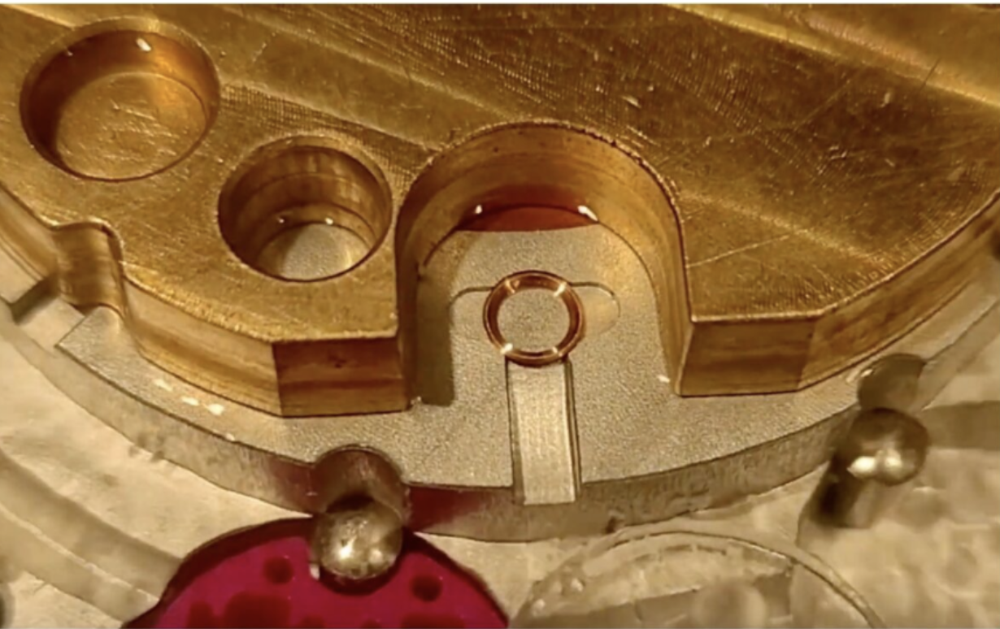
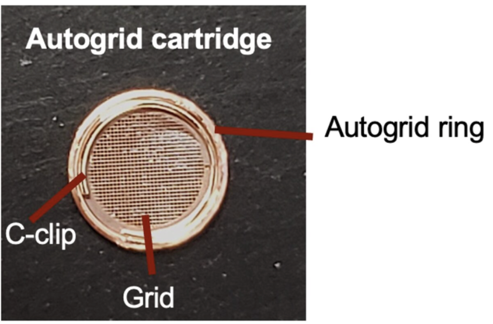

# Clipping

#### Goal: to enable grids to be used with a Thermo Fisher autoloader.

#### Introduction:

In order for the grids to be loaded into the microscope, they must be clipped so that they can be more easily transferred and loaded/unloaded from the stage by the autoloader system within the microscope, which is done by a retractable robotic arm. This process must be completed under liquid nitrogen and done as quickly and carefully as possible, since exposing the grids to the air allows ice contaminants to form on them. 

#### Protocols/Resources

[Base knowledge/SOP](https://www.cryoemcenters.org/merit-badge/tfs-autogrid-clipping/grid-clipping-sop/)

[Video tutorial](https://drive.google.com/file/d/1dpESuZTEyutyKTKS-Qug6i3vzwtKytiZ/view)

#### Materials

- C-clips (one per grid)
- Autoloader rings (one per grid)
- C-clip clipping tool (one per grid)
- Autogrid tweezers
- Fine-tip tweezers
- Clipping station with clipping pedestal
- Autogrid storage box 
- Pen tool for autogrid box lid 
- Frozen grids 
- Sample transfer dewar
- Dewar for liquid nitrogen 
- Screwdriver tool 
- Heat block
- Additional tools/tweezers for handling boxes/grids

    
    **Figure 1. Tools for clipping grids.**

#### Method

1. First, using a pair of fine-tip tweezers, carefully pick up a c-clip from its center and shove it into the hole at the top of the clipping tool, as shown below. C-clip should be completely below the lip of the hole and at an angle, not perpendicular to the opening. 

    
    **Figure 2: Correct orientation of c-ring in clipping tool.**
    
2. Place the hole of the clipping tool flat against the tabletop and gently press it down twice. Check the tip of the hole to ensure that the c-clip has positioned itself parallel to the edge of the hole. 

    
    **Figure 3: Correct placement of c-ring inside clipping tool.**
    
3. Place the autogrid storage box inside the clipping station and use the pen tool to remove the lid and place it to the side within the station. 
4. Now you will cool down the clipping station. Get some liquid nitrogen in a dewar. Pour it into the clipping station and cover with a lid between pours. Continue repeating this process until the station is cooled down (you will hear a hissing sound and the heavy boiling will stop). 
5. Transfer the autogrid rings using a pair of tweezers to their slot on the top of the brass pedestal in the clipping station.
6. Quickly transfer the gridbox containing your frozen grids to the clipping station and use the screwdriver to loosen the lid, then move it so that the opening is over a slot containing a grid. 
7. Remove the lid from the clipping station and place your tools inside to cool down (clipping tools, autogrid tweezers, and fine-tip tweezers). 

    
    **Figure 3: Clipping station including tools.**

8. Using the tweezers, transfer an autogrid ring, flat side down, into the loading pedestal open position (shown below). 

    
    **Figure 4: Autogrid ring on loading pedestal position.**
    
9. Carefully remove a grid from the gridbox and position it flat on the center of the autogrid ring, copper side facing up.
    * Tip: be cautious throughout the following process to keep all tools and grids inside the liquid nitrogen vapor, topping up liquid nitrogen levels in the dewar if necessary. Additionally, if a tool is taken out of the vapor and frost begins to form on it, make sure to store it in a heat block and take another tool instead to prevent contamination. Fine tweezers can be placed on the counter and SHOULD NOT be stored in the heat block as this can bend their tips. 
10. Using the autogrid tweezers, insert them into the slot in the center of the loading pedestal and rotate it counterclockwise so that the grid and autoloader ring are centered under the hole to the left. 
11. Take a clipping tool and insert it into the hole over the grid. Making sure it is flat, press down firmly with the clipping tool, then remove it and place it to the side. 
12. Use the autogrid tweezers to rotate the pedestal clockwise back to its original position, then transfer the clipped grid to the autogrid box with the autogrid tweezers, checking to ensure that the grid was clipped properly before storing it. Have the copper side of the grid face “up” towards the numeral in the grid box.

    
    **Figure 5: Properly clipped grid.**

13. Repeat steps 8-12 for all your grids. 
14. Fill a sample transfer dewar with liquid nitrogen and allow it to cool. Use the pen tool to secure the plastic lid on the autogrid box, then quickly transfer it to the sample transfer dewar. Now the grids can be stored in a storage dewar or loaded into a cassette for screening. 
15. Now that you are done clipping, be sure to clean up. Return buttons and the fine tweezers to their proper storage location where they will defrost. Place the rest of the tools onto the heat block so they can defrost. Place the clipping station in the proper drying area. Place the sample transfer station in the proper drying location. 

