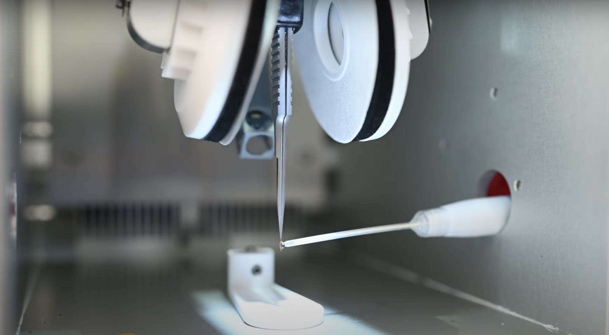

# Freezing

## Goal

*[folded RNA -> frozen grid]*

Once we have folded RNA we want to put it on the grid and freeze it as quickly as possible.

## Introduction

We want to create a thin layer of ice with RNA in random orientations but in an even distribution throughout. We accomplish this through first plasma cleaning the grid, applying the sample to the grid and blotting away liquid to create a thin film, then plunge freezing the grid into liquid ethane to vitrify the ice. Generally, optimizing the conditions of grids is still a trial and error process with variables such as the time and amount of cleaning, the length and amount of blotting, and the grid type, which can be varied. With RNA there is generally not a preferred orientation problem.

## Protocols/Resources

[Excel quick link](https://docs.google.com/spreadsheets/d/1LdVuB27zxUWZSrtuxye2XQu5pgyFG9FFp4FtjlcBbZo/edit#gid=892379557)

[Base Knowledge and SOP](http://www.cryoemcenters.org/merit-badge/tfs-vitrobot-mark-iv/)

[Video Series](http://www.cryoemcenters.org/merit-badge/tfs-vitrobot-mark-iv/)

[S2C2 tutoral video](https://drive.google.com/file/d/1La8oMP-3LwFKTZCNo2YovGavny6JLMma/view)

## Materials

- Grids (Quantifoil, R=1.2/1.3, Cu 300)
- Vitrobot tweezers
- Liquid nitrogen holder
- Contamination ring
- Brass cup
- Grid box holder
- Spider
- Filter papers (prepunched Whatman #540)
- Membranes (ACLAR 33)
- Gridboxes
- Fine-tipped tweezers
- Autogrid tweezers
- Sample transfer dewar
- Screw pen (for gridbox caps)
- Larger tweezers of choice
- p10 or p20 pipette with correct tips
- Folded sample
- Dewar

## Method
1. Prepare the vitrobot by turning on the machine by flipping the switch on the back right of the machine.

    

    **Figure 1. Vitrobot Mark IV machine. A) Screen. B) Chamber with blotting pads. C) Humidifier. D) Ethane lift.**

2. Using vitrobot pen, set parameters on the vitrobot. Set desired humidity and temperature settings, and turn the humidifier on. If the humidifier says it is empty, add 60mL of distilled water. Go to the options tab and set other parameters. Some suggested starting parameters can be found in Table 1.

    |   Parameter   |  Suggested  |
    |:-------------:|:-----------:|
    |Humidity       |100%         |
    |Temperature    |4&deg;C      |
    |Blot Time (s)  |4            |
    |Wait Time (s)  |0 secs       |
    |Blot Force     |0            |
    |Blot Number    |1            |
    |Use Footpedal  |Yes          |
    |Humidifier Off During Process|Yes|
    |Skip Grid Transfer|Yes       |
    **Table 1. Suggested starting parameters for Vitrobot freezing of RNA samples.**

3. Fill a dewar with liquid nitrogen.
4. Glow discharge your grids. Carefully use your fine-tipped tweezers to remove the desired number of grids from their container and lay them flat on the glow discharge holder, copper side up, for glow discharging.
5. Carry your grids to the glow discharger and set them in the pedestal. Suggested starting parameters for glow discharging are shown in Table 2 below.  

    |   Parameter           |  Suggested  |
    |:---------------------:|:-----------:|
    |Current (mA)           |15           |
    |Glow Discharge Time (s)|30           |
    |Wait Time (s)          |10           |
    |Gas                    |1 (air)      |
    **Table 2. Suggested starting parameters for glow discharging grids.**

6. Attach filter papers to the vitrobot. Membranes are placed under the filter papers to prevent lipids and other particles on the vitrobot from contaminating your samples.
7. Test that the vitrobot is set up correctly by using the foot pedal to run through the cycle once, checking that the blot pads are centered.
8. You will now assemble the ethane holder to cool down your ethane for plunge freezing. Place the brass ethane cup, grid box holder, spider, and anti-contamination ring in the LN2 (liquid nitrogen) container. Additionally, you can place the grid button in the grid button holder and use the screwdriver to loosen the cap before cooling begins.

    

    **Figure 2. Freezing apparatus. A) Spider. B) Brass cup. C) Button holder. D) Liquid nitrogen container. E) Contamination ring.**

    

    **Figure 3. Freezing apparatus assembled, including button.**

9. Fill the apparatus with liquid nitrogen and continue to refill as liquid nitrogen evaporates until the metal has reached the same temperature as the liquid nitrogen (will hear a hissing and a heavy boiling).
10. Attach the ethane dispenser to the spider (shown below), open the main ethane line, and very slowly and carefully, twist open the ethane dispenser to fill the brass cup with liquid ethane. When the ethane has filled the brass cup, close the ethane dispenser, and lift it off the brass cup.
    *Tips for this step: open the ethane dispenser until you can see liquid and bubbles forming around the tips of the plastic. Stop opening and wait for a while until you see some liquid drops forming at the mouth of the opening. If you open too far, you will see a plume of white gas entering the brass cup. In this case, close the dispenser using very small movements until the plume of gas has lessened. The brass cup must cool down enough so that the ethane gas will condense into liquid at the bottom of the cup, so you may have to wait a moment for the gas to clear and liquid to begin forming visibly at the bottom of the cup.

    

    **Figure 4. Ethane dispenser attached to spider.**

11. Cool down the liquid ethane using the spider. When the first crystals have formed in the liquid ethane along the walls of the brass cup, it is the correct temperature for freezing. Quickly remove the spider so as to avoid freezing the ethane solid. If the ethane is frozen solid, it can be warmed up by placing the spider upside down on the brass cup or by using a warm tool to carefully melt the ethane along the walls of the brass cup.
12. Now you will collect your samples and begin plunge freezing. Using a pair of autoloader tweezers, move the plastic cap of the gridbox so that the opening is over the correct slot in the gridbox. Take the vitrobot tweezers (shown below) and carefully pick up a single grid, keeping it as centered as possible and as close to the tip as possible, with the grid orientation as shown below. Fasten the grid in place by sliding the grip down the tweezers to hold it together, only slide to the first knotch.

    

    **Figure 5. Vitrobot tweezers, shown with orientation of grids. Carbon side should be facing the same direction as the side of tweezers with small red dot on the handle.**

13. Fasten the tweezers to the vitrobot as shown below. Ensure that the carbon side of the grid is facing the direction in which sample will be applied (if you are right-handed, the carbon should be facing to the right).
14. Depress the foot pedal to raise the tweezers with the grid into the environmental chamber. Place the liquid nitrogen container with the cold liquid ethane onto the ethane lift and depress the pedal again to raise the ethane.
15. Depress the foot pedal to lower the tweezers so that you can load your sample. Open the side of the vitrobot and pipette 3 uL of your sample through the opening onto the carbon side of your grid. Quickly push the footpedal again, which causes the vitrobot to blot the sample and then plunge it into the liquid ethane. The ethane lift will lower so that you can access the sample.

    

    **Figure 6. Pipetting sample onto grids in the vitrobot.**

16. The next few steps must be performed as quickly and carefully as possible, being sure to avoid raising the grid into the air or smashing it. Carefully detach the tweezers from the vitrobot, being sure to keep the grid suspended in the liquid ethane.
17. If desired, remove the liquid nitrogen container from the vitrobot stand and set to the side. This allows for an easier transfer of the grid to the gridbox. Be sure to keep the grid submerged in liquid ethane the whole time.
18. Holding the tweezers closed with one hand, raise the grip so that the tweezers can be opened again. Be sure to not prematurely open the tweezers and lose the grid.
19. Still keeping the tweezers closed, quickly move the grid from the liquid ethane into the liquid nitrogen. Then, drop the grid into its correct slot in the gridbox.
20. Using autoloader tweezers, move the cap of the gridbox so that the opening is positioned over the next slot and repeat steps 12-19. It is recommended to prepare about 3 grids of each sample and concentration.
When all grids and samples have been frozen, use the screw tool to fasten the lid of the gridbox.
21. Fill a sample transfer dewar with liquid nitrogen and allow it to cool down. Quickly transfer the gridbox into the transfer dewar and close the lid.
22. Now that you are done freezing, you will clean up. Make sure to remove dirty filter papers from the vitrobot, and tap “Exit” to power down the machine. Once the screen darkens, you can flip the switch on the back right of the machine. Set the liquid nitrogen apparatus in the proper drying area and ensure that the main line to the ethane has been closed.
